# Base16 Black Metal

A collection of Black Metal inspired base16 schemes for Helix.

This collection is port of the original themes from [@metalelf0][original-author] for [Vim][vim-themes] and [Neovim][neovim-themes].

## Previews

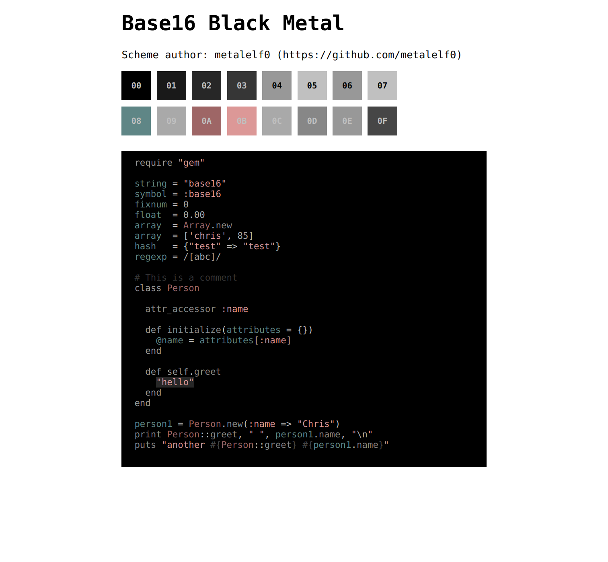
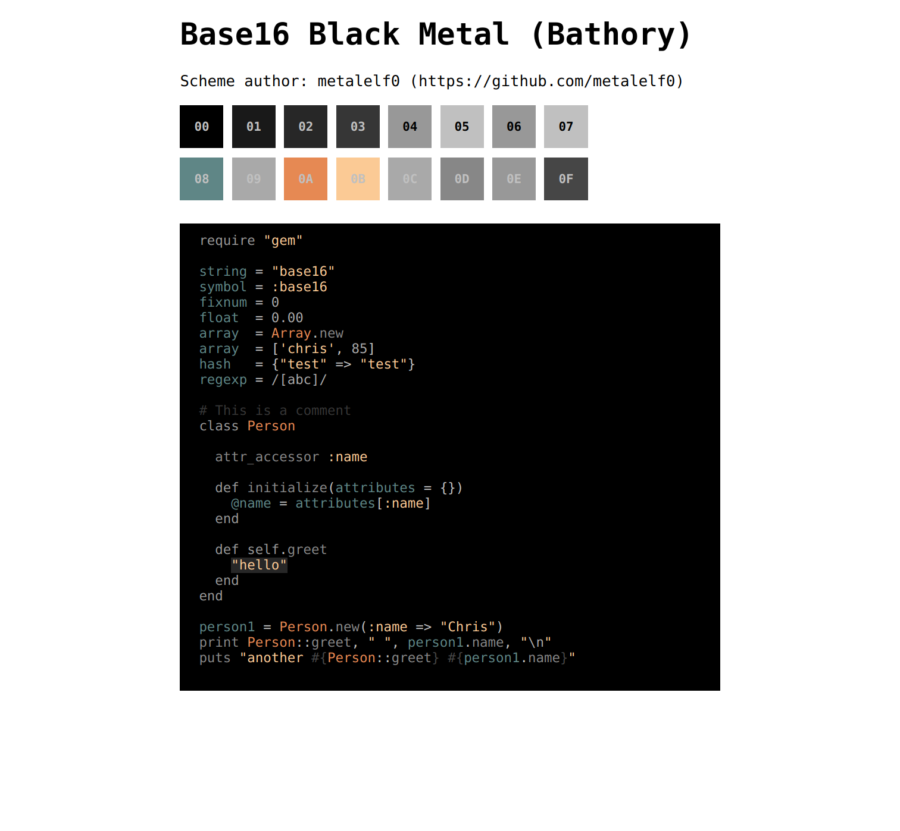
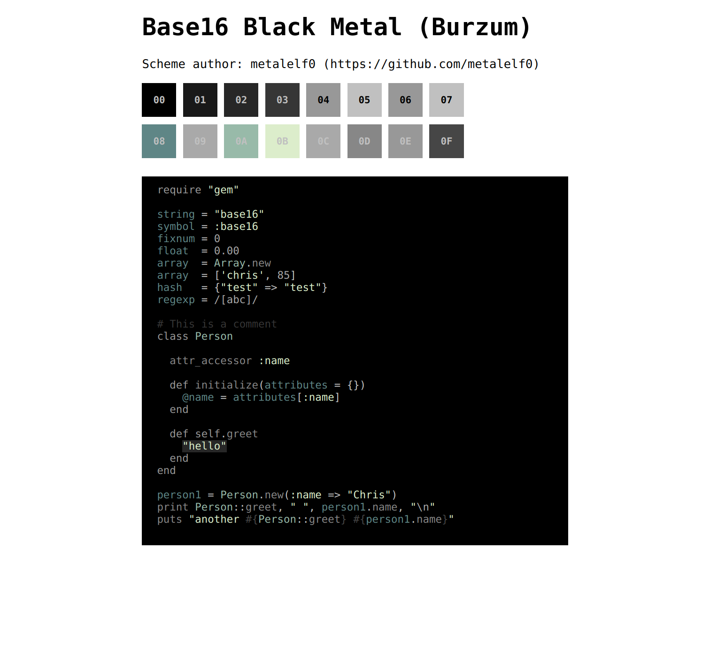
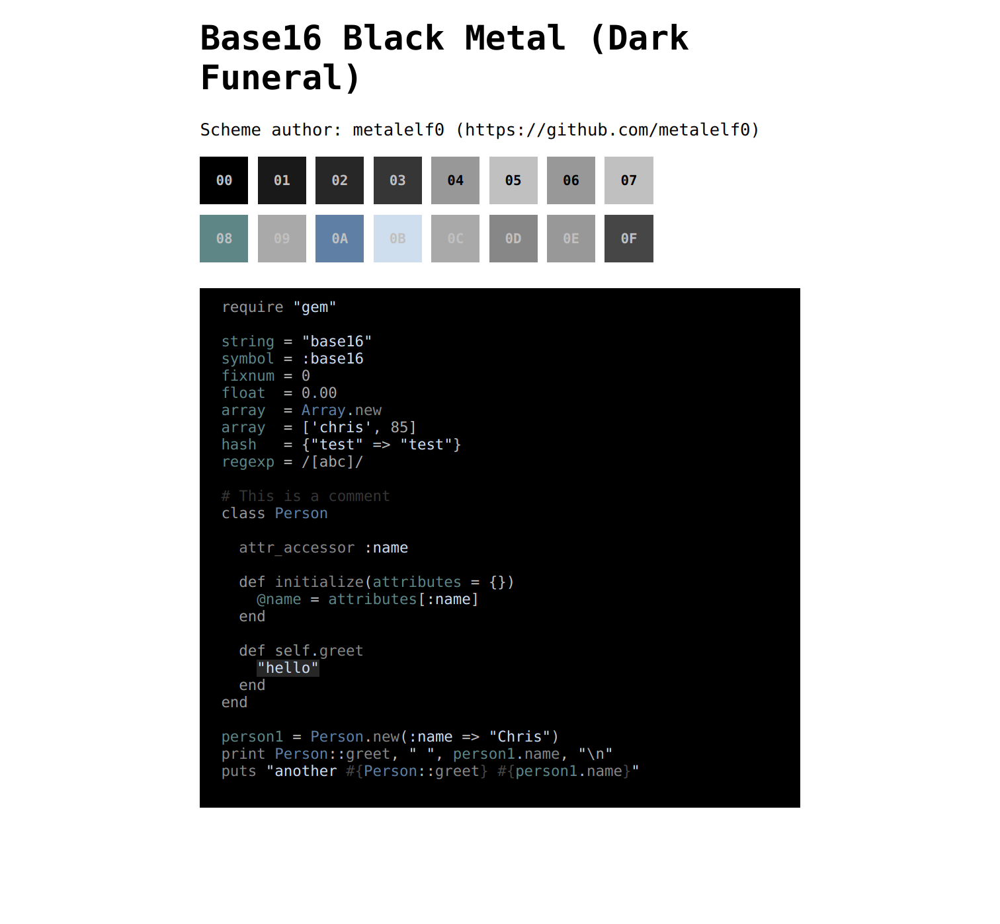
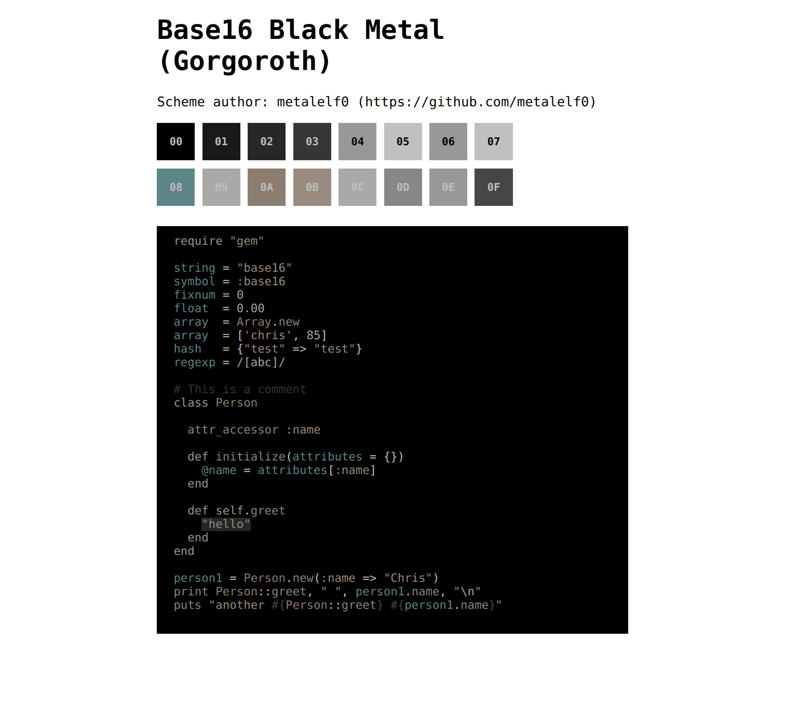
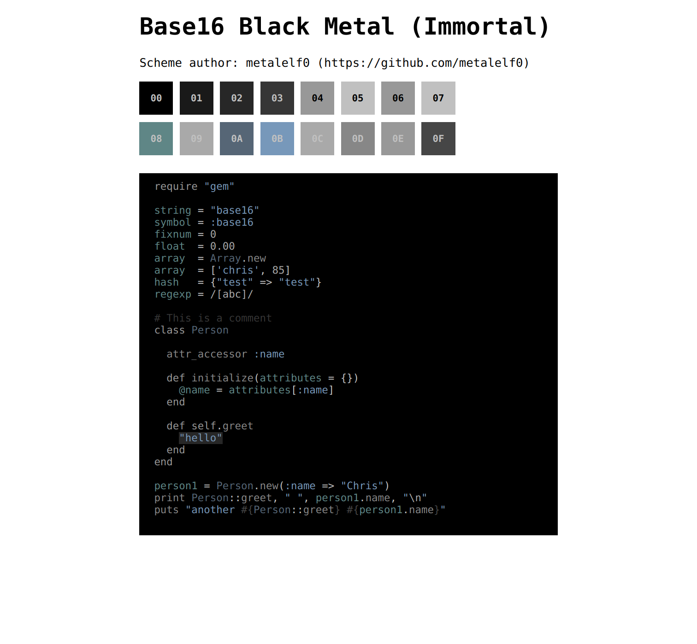
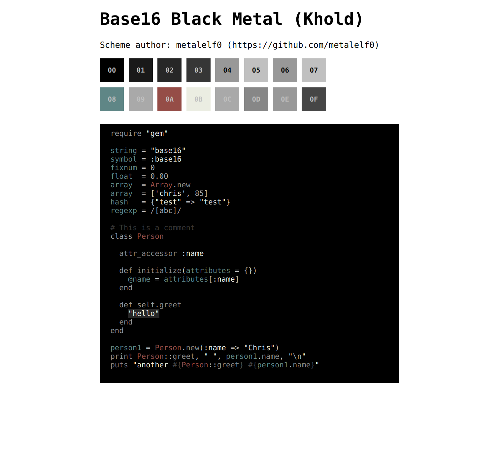
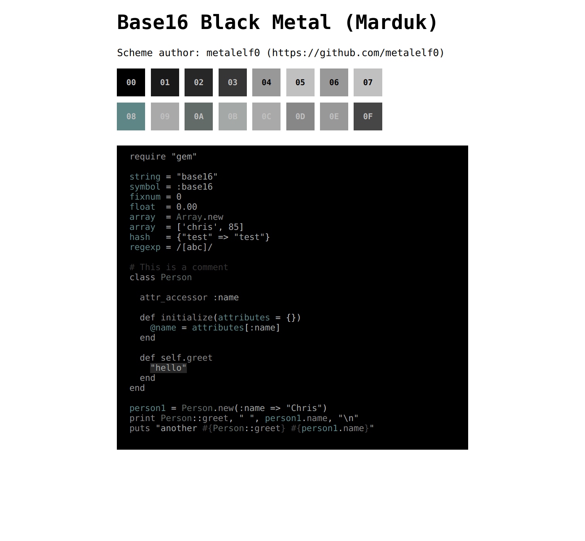
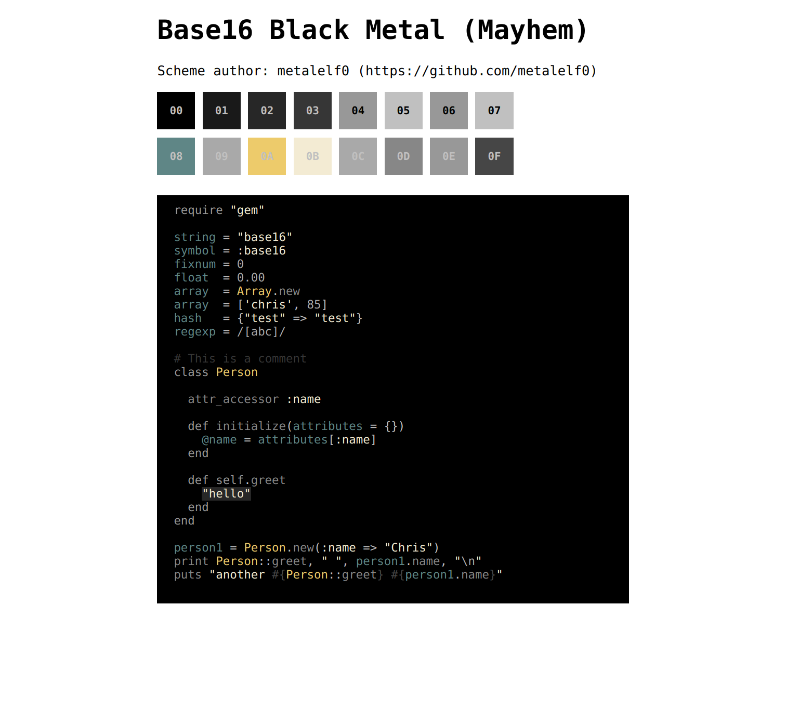
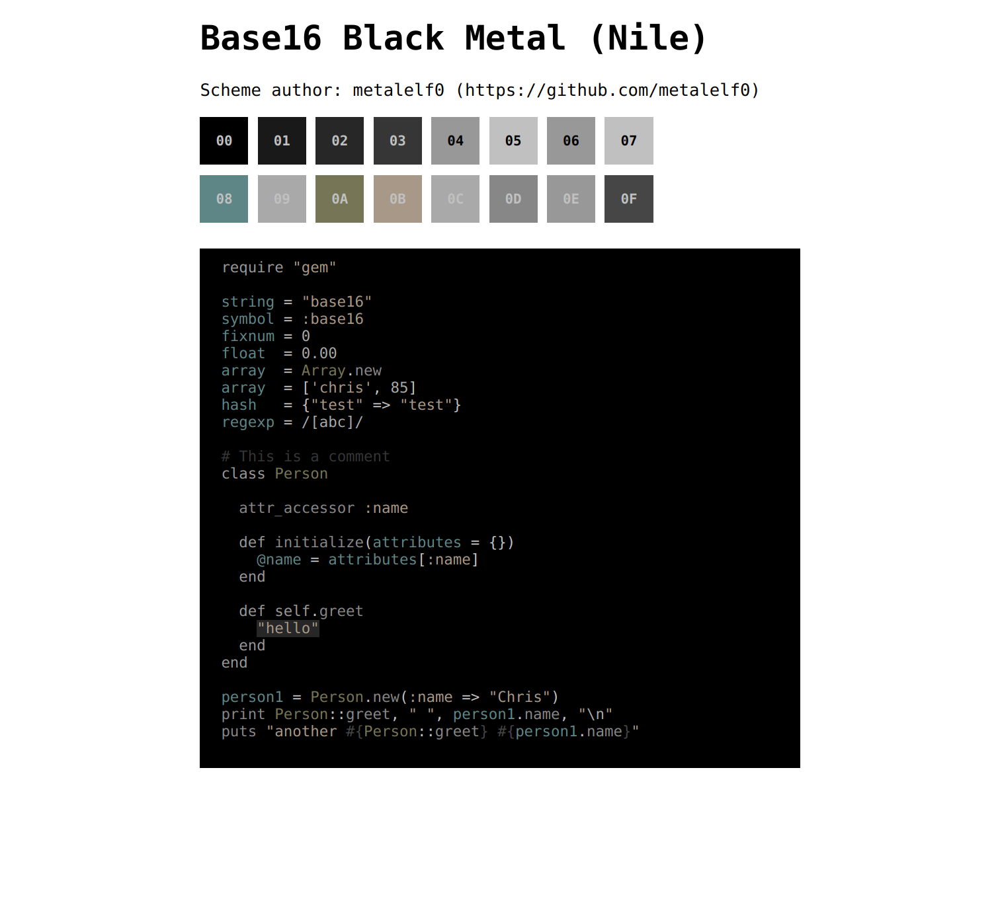
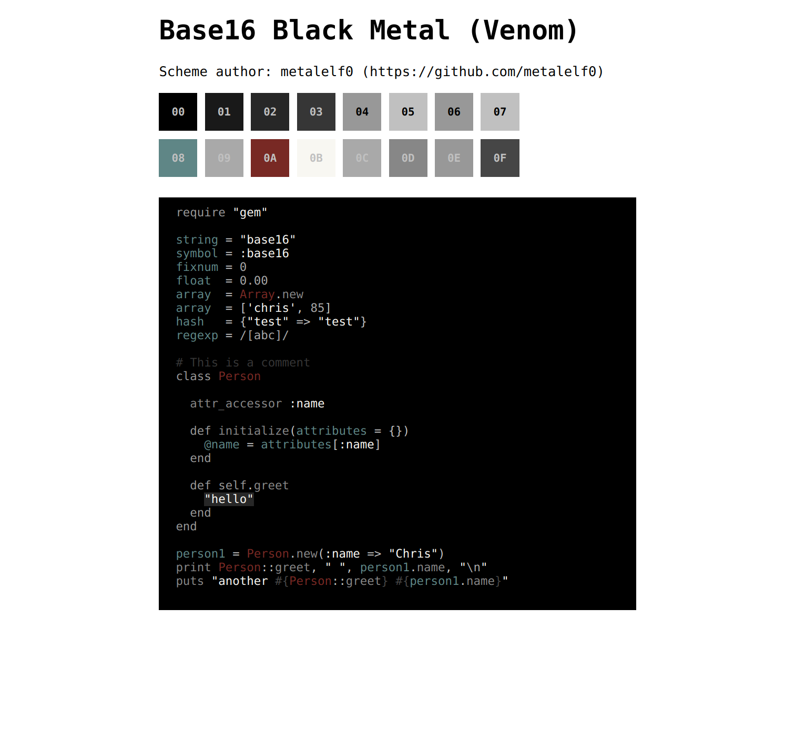

## Manual Install

To install Base16 Black Metal for Helix, please download the `theme.toml` file you want and place it
inside your Helix configuration's `theme` folder. I recommend naming the file `theme-dev.toml` to avoid
conflicting with the theme already bundled with Helix.

## License

This schemes are available as open source under the terms of the [MIT License](https://opensource.org/licenses/MIT).

[original-author]: github.com/metalelf0
[neovim-themes]: github.com/metalelf0/black-metal-theme-neovim
[vim-themes]: github.com/metalelf0/base16-black-metal-scheme
